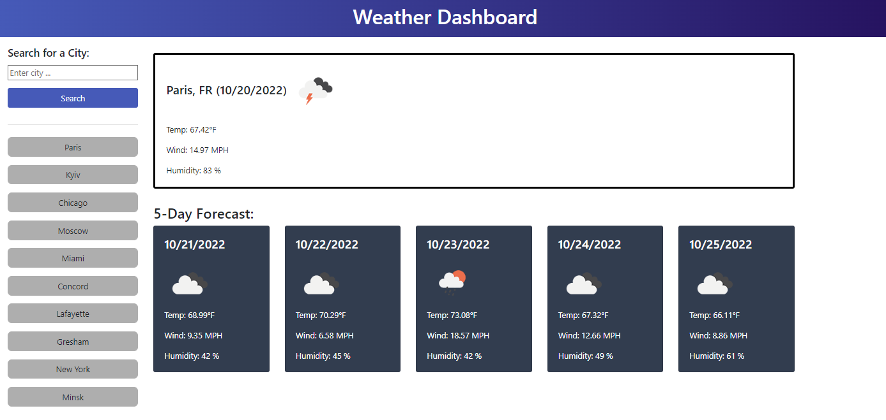

# weather-dashboard-5-day-forecast

## Description
This is an application for travelers. It allows to see the weather outlook for multiple cities, what is helpfull to plan a trip accordingly.

Tech. stack:
- HTML
- CSS
- JavaScript
- Bootstrap

Saved cities are stored in browser's localStorage

## Usage
This site was built using [GitHub Pages](https://pages.github.com/). 

Available by link https://olgagav.github.io/weather-dashboard-5-day-forecast/

Application present a simple dashboard which will show the weather and forecast for the next 5 days

Input City name and click Search button. You will see dashboard with weather today and forecast for 5 days on the right side.

City from search will be available in history under the search area. You can click it later to see the weather for this city.

_Note_: search history stored in user browser's localStorage.

After the search user see dashboard with search results for the city

## Credits

Developed by Olga Gavrushenko

Mockup and Learning materials [Berkley Extension: coding bootcamp](https://extension.berkeley.edu/)

## License
MIT
